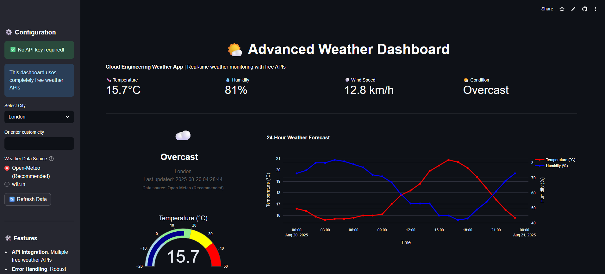
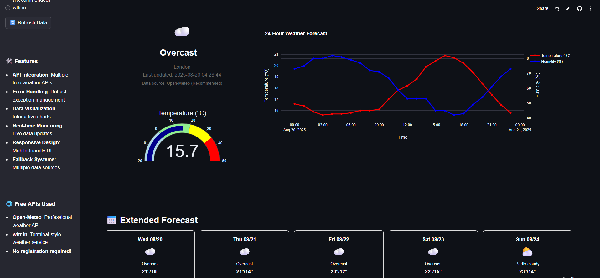

# 🌤️ Advanced Weather Dashboard

A professional weather monitoring application built with Python and Streamlit, designed to demonstrate cloud engineering skills and best practices.


## 🎯 Project Overview

This weather dashboard showcases key technical skills relevant to cloud engineering:

- **API Integration**: RESTful API consumption with error handling
- **Real-time Data Processing**: Live weather data with automatic updates
- **Data Visualization**: Interactive charts and gauges using Plotly
- **Responsive Web Design**: Mobile-friendly interface
- **Multiple Data Sources**: Fallback systems and API redundancy
- **Error Handling & Monitoring**: Robust exception management
- **Zero Setup Required**: No API keys or registration needed!

## ✨ Features

### Current Weather Display
- Real-time temperature, humidity, pressure, and wind speed
- Weather conditions with emoji icons
- Temperature gauge visualization
- Sunrise/sunset times
- Visibility and cloud coverage

### Advanced Forecasting
- 24-hour temperature and humidity trends
- 5-day weather forecast cards
- Interactive charts with hover details
- Temperature range analysis

### User Experience
- City selection with custom input
- Responsive design for all devices
- Real-time data refresh
- Professional UI with custom styling

## 🛠️ Technology Stack

| Technology | Purpose |
|------------|---------|
| **Python 3.8+** | Core application logic |
| **Streamlit** | Web framework and UI |
| **Plotly** | Interactive data visualization |
| **Requests** | HTTP API calls |
| **Pandas** | Data manipulation |
| **Open-Meteo API** | Professional weather forecasting (free) |
| **wttr.in** | Terminal-style weather service (free) |
| **Geocoding API** | Location coordinate lookup (free) |

## 🚀 Quick Start

### Prerequisites
- Python 3.8 or higher
- **No API keys required!** ✅

### Installation

1. **Clone the repository**
   ```bash
   git clone https://github.com/yourusername/weather-dashboard.git
   cd weather-dashboard
   ```

2. **Install dependencies**
   ```bash
   pip install -r requirements.txt
   ```

3. **Run the application**
   ```bash
   streamlit run weather_dashboard.py
   ```

4. **Access the dashboard**
   - Open your browser to `http://localhost:8501`
   - Select a city and explore the weather data
   - No setup required - just run and use!

## 🔧 Configuration

### No Configuration Required! 🎉
This dashboard uses completely free APIs that require no registration:

- **Open-Meteo**: Professional weather API with global coverage
- **wttr.in**: Simple, reliable weather service
- **Free Geocoding**: Location lookup service

### Optional Environment Variables
For production deployment, you can set preferences:
```bash
export DEFAULT_CITY=your_preferred_city
export PREFERRED_API=open-meteo
```

## 📊 Architecture & Design

### Application Structure
```
weather-dashboard/
├── weather_dashboard.py    # Main application
├── requirements.txt        # Python dependencies
├── README.md              # Project documentation
└── screenshots/           # Application screenshots
```

### Key Components

#### `WeatherAPI` Class
- Handles all external API interactions
- Implements proper error handling and timeouts
- Supports both current weather and forecast endpoints

#### Data Processing Pipeline
1. **API Request** → Raw JSON data from OpenWeatherMap
2. **Data Validation** → Error checking and exception handling
3. **Data Transformation** → Convert units and format timestamps
4. **Visualization** → Generate interactive charts and displays

#### UI Components
- **Metrics Dashboard**: Key weather indicators
- **Temperature Gauge**: Real-time temperature visualization
- **Forecast Chart**: 24-hour trends with dual y-axis
- **5-Day Forecast**: Daily weather cards with icons

## 🎨 Screenshots

### Dashboard Overview


### Application Features


## 🌐 Deployment Options

### Streamlit Cloud (Recommended)
1. Push code to GitHub
2. Connect repository to [share.streamlit.io](https://share.streamlit.io)
3. Add API key to Streamlit secrets

### Docker Deployment
```dockerfile
FROM python:3.9-slim
WORKDIR /app
COPY requirements.txt .
RUN pip install -r requirements.txt
COPY . .
EXPOSE 8501
CMD ["streamlit", "run", "weather_dashboard.py", "--server.port=8501", "--server.address=0.0.0.0"]
```

### Cloud Platform Options
- **AWS EC2**: Deploy with auto-scaling groups
- **Google Cloud Run**: Serverless container deployment
- **Azure Container Instances**: Managed container service
- **Heroku**: Simple git-based deployment

## 🔍 Cloud Engineering Skills Demonstrated

This project showcases several key competencies for cloud engineering roles:

### API Management
- RESTful API integration with proper authentication
- Error handling and retry logic
- Rate limiting awareness
- Timeout management

### Data Engineering
- Real-time data processing
- Data transformation and validation
- Time series data handling
- Caching strategies

### DevOps Practices
- Dependency management with requirements.txt
- Environment variable configuration
- Containerization ready
- Documentation and README best practices

### Monitoring & Observability
- Error logging and user feedback
- Performance metrics (API response times)
- User interaction tracking
- Health check endpoints (extensible)

### Scalability Considerations
- Stateless application design
- External API dependency management
- Resource usage optimization
- Horizontal scaling readiness

## 📈 Future Enhancements

### Technical Improvements
- [ ] Add Redis caching for API responses
- [ ] Implement database storage for historical data
- [ ] Add Prometheus metrics collection
- [ ] Create health check endpoints
- [ ] Add unit and integration tests

### Feature Expansions
- [ ] Weather alerts and notifications
- [ ] Historical weather data analysis
- [ ] Multiple location comparison
- [ ] Weather maps integration
- [ ] Mobile app development

### DevOps Integration
- [ ] CI/CD pipeline with GitHub Actions
- [ ] Infrastructure as Code (Terraform)
- [ ] Kubernetes deployment manifests
- [ ] Monitoring and logging stack
- [ ] Automated testing pipeline

## 🤝 Contributing

Contributions are welcome! Please feel free to submit a Pull Request. For major changes, please open an issue first to discuss what you would like to change.

### Development Setup
1. Fork the repository
2. Create a feature branch (`git checkout -b feature/AmazingFeature`)
3. Commit your changes (`git commit -m 'Add some AmazingFeature'`)
4. Push to the branch (`git push origin feature/AmazingFeature`)
5. Open a Pull Request

## 📝 License

This project is licensed under the MIT License - see the [LICENSE](LICENSE) file for details.

## 📞 Contact

**Your Name** - [your.email@example.com](mailto:your.email@example.com)

**Project Link**: [https://github.com/yourusername/weather-dashboard](https://github.com/yourusername/weather-dashboard)

**Live Demo**: [https://your-weather-dashboard.streamlit.app](https://your-weather-dashboard.streamlit.app)

---

⭐ **Star this repository if it helped you in your cloud engineering journey!**
